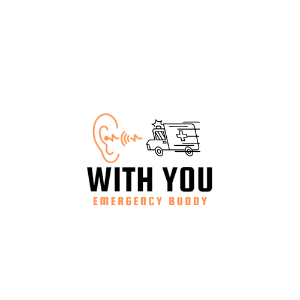

# YPStem

## Inspiration:
In a world rapidly moving towards inclusivity in all domains, features allowing accessibility to the deaf and hard of hearing community gain a lot of importance. When the features are related to emergency services, the services are requirements, not a luxury.
Across the globe, emergency services rely on a telephone/mobile number/hotline, to be contacted by the affected in difficult situations. People using SL(Sign Language) as their means of communication lose their right to these fundamental services. The inspiration for this project,thus, comes from the necessity of providing access to emergency services during times of crisis.

## What it does
The website, named **With You-Emergency Buddy**, interprets ASL components for "accident","ambulance","breathe","emergency","fire" and "help" which are basic signs which can be instrumental in any catastrophic situations. On detecting a specific sign, a message is sent to the emergency service contact number, including the name of the emergency faced, along with location coordinates, IP address of the device and Region. Relying on the Text-to-911 functionality,**With You** allows emergency services to be requested, with just the ASL signs shown by the affected.

## How we built it
For building **With You**, we have created an LSTM(Long short-term memory) machine learning model, utilizing a custom dataset for the ASL signs "accident", "ambulance", "breathe", "emergency","fire" and "help". The model yielded **98%** accuracy with MediaPipe solutions for detecting hand signs. Deployed on the **With You-Emergency Buddy** website using Flask. The SMS that will be sent to the emergency service contact number is done using fast2sms Dev API which according to the sign recognized will send messages. The location of incident along with the ip address of device is fetched using geolocation library.

## Challenges we ran into
The main challenges we faced included a lack of a ready dataset for emergency signs, the difficulty in decoding signs which were not just static, but involving continuous movement, and the obstacle in messaging the emergency service contact number directly from the website.

## Accomplishments that we're proud of
The ML model used can efficiently detect the ASl signs, with an accuracy of **98%**. Just showing the sign, a person can directly contact the emergency sevice in a matter of second. Even though we were in different cities, we ensured we completed this project on time and with a good accuracy.

## What we learned
1) LSTM
2) Flask deployment
3) Website-to-SMS

## What's next for With You - Emergency Buddy
The next step for **With You** has to be the inclusion of many more dynamic ASL signs, making **With You** a leading solution for accessibility issues our fellow humans face. Deploying the same model on an Android/ IOS application will also be a part of **With You**'s future scope.

## How to use the Website
1) Click on the **Detect Sign** button. 
2) Wait for 2-3 minutes for the camera to be switched on.
3) Once switched on, place your hands in front of the camera and look for the hand tracker to appear on your hand.
4) Show the emergency sign. Detected sign will be shown on the top of the frame.
5) To exit camera, press 'Q'on your keyboard. Message will be sent to emergency contact number immediately.
